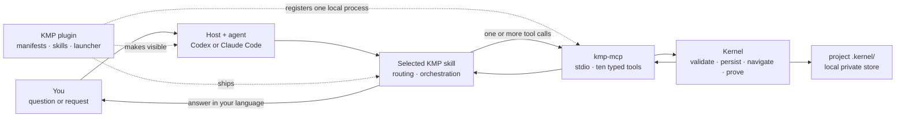
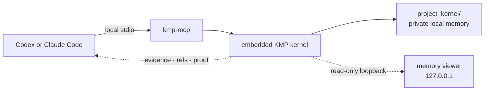
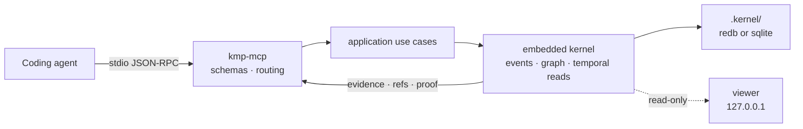

# KMP by Underpass

> Part of [Underpass AI](https://underpassai.com) — memory, coordination, and execution infrastructure for reliable AI agents.

Local, private, navigable memory for AI coding agents. KMP runs inside one
local MCP process, stores each project's memory on your machine, and preserves
what was decided, when it changed, why it changed, and which evidence supports
it.

KMP is free and open source under the [Apache 2.0 license](./LICENSE).

Start local: no external database, API key, account or remote memory service.
If an organization later needs one shared memory across people, agents and
services, the same protocol has an enterprise edition for Kubernetes.

## Your first local memory, in two minutes

Choose your coding agent. Both paths run KMP locally: no external database,
API key, remote memory service or Rust toolchain.

**1. Install the plugin, and the engine it expects**

Claude Code:

```text
/plugin marketplace add underpass-ai/plugins
/plugin install kmp@underpass
/kmp:setup
```

Codex CLI:

```bash
codex plugin marketplace add underpass-ai/plugins
codex plugin add kmp@underpass
```

Then run the native `kmp-setup` skill.

The plugin ships the MCP declaration, skills and launcher, so there is nothing
to register by hand. Setup downloads the `kmp-mcp` binary matching the plugin's
version and verifies it against the published checksum. Restart the session
afterwards so the local tools load.

**2. Write something worth remembering**

In a project directory, say it in plain words:

> Remember that checkout retries are capped at two with exponential backoff
> because unbounded retries caused request amplification.

The agent stores it with `kmp_write_memory`, under an *about* — a stable id
for what the memory is about, conventionally `project:<name>`. It becomes a
durable decision with evidence, not a transcript line. When memory entries are
connected, the typed relation carries why that specific connection holds.

**3. Recover it in a new session**

Open a new session in the same directory and ask:

> What do we know about this project?

The agent calls `kmp_wake { about: "project:<name>" }` and gets back where
the work stood, your decision among it, with the why still attached. The
second session did not re-derive it and did not read the first one's
transcript. That is the whole claim, and you just watched it happen.

**When something looks wrong** — `/kmp:doctor` checks the setup end to end and
names the one thing to fix. **To see memory before writing any** — `/kmp:demo`
loads a real incident, wrong turn included, and walks the moves against it.
**To learn the surface** — `/kmp:moves`, ten moves and when to reach for each.

**Then continue** with [How people use KMP](#how-people-use-kmp) below. The
[plugin guide](./plugins/kmp/README.md) covers local installation, upgrades,
diagnosis, storage and every explicit workflow in depth.

## Local and private by default

“MCP server” is a protocol role, not a hosted service. Codex or Claude Code
starts `kmp-mcp` as a child process on your machine and talks to it over
stdin/stdout. The kernel runs inside that process.

| | Default local mode |
|:--|:--|
| Memory service | None; there is no remote KMP endpoint or Underpass account |
| MCP transport | Local stdio between the coding agent and `kmp-mcp` |
| Storage | The project's local `.kernel/` directory, using a bundled redb or sqlite engine |
| Viewer | Read-only, loopback-only at `http://127.0.0.1:7317/` |
| External database | None |
| Outbound memory traffic | None |
| Portable copy | `.kmp/memory.jsonl`, maintained for review, backup and optional git sharing |

KMP does not send memory contents to Underpass. Setup and version checks may
contact GitHub for release metadata or a checksummed binary; that is package
delivery, not memory synchronization. The memory stays on your machine unless
you deliberately commit or push `.kmp/memory.jsonl`, or configure the
enterprise Kubernetes edition described below. If the coding agent itself uses
a cloud model, the evidence KMP returns to that agent is subject to the host's
own data policy.

## How people use KMP

In normal work, talk to the agent; you do not need to choose an MCP tool. The
agent classifies the request, runs the appropriate memory workflow, and answers
in your language from the evidence KMP returns. KMP itself does not invent an
answer: reads return stored evidence, refs and proof; Ask returns `UNKNOWN`
when the memory does not support the question.

Most read examples below use the bundled
[checkout-latency demo](./plugins/kmp/demo/README.md), so every stated fact can
be inspected in a real store. They describe the real response shape, not canned
replies:

| What you want | Example question or request | What happens, and what you get | Route |
|:--|:--|:--|:--|
| Resume known work | “Where does the checkout-latency incident stand?” | The compact packet shows that v4.12.1 restored p99 to 250ms, the pool fell to 22/60, and a permanent retry-budget constraint followed. It also carries the decisions, open threads and recorded reasons. An empty packet would mean this about has no memory yet. | `kmp_wake` |
| Ask a factual or semantic question | “Why did the rollback not fix the latency?” | The evidence-backed answer points out that restoring the pool from 40 to 60 connections left p99 effectively unchanged; the later evidence identifies 6.1x client retry amplification. The answer carries refs, or is `UNKNOWN` when no evidence supports it. | `kmp_ask` |
| Ask in a different language from the stored evidence | “¿Por qué no arregló la latencia el rollback?” | The agent asks first in Spanish. After `UNKNOWN`, it may retry the question in the configured fallback language, then answer in Spanish from the demo's English evidence: restoring pool capacity did not change p99, while gateway logs showed 6.1x retry amplification. Stored evidence, refs and relation reasons are never translated or rewritten. | `kmp_ask` + configured fallback |
| Review a time interval | “What happened yesterday?” or “What changed since I last looked?” | The complete interval in your timezone, page by page, with replacements and contradictions called out. If a cap prevents completion, the answer names the exact continuation instead of presenting a partial interval as complete. Temporal questions do not start with semantic Ask. | `kmp-catchup` → `kmp_goto` + `kmp_forward` |
| Recover what was known at a moment | “What did we believe at 15:05?” | The state at that moment shows why the pool-size rollback looked right then: the pool was saturated after a 60-to-40 connection change. Evidence discovered later does not leak backward into that view. | `kmp_goto` |
| See context around an event or decision | “What happened around the pool-size rollback?” | The neighborhood shows the saturated pool before the decision and the unchanged latency after capacity was restored. | `kmp_near` |
| Explain how the work reached its current state | “How did we get from the first symptom to the hotfix?” | The timeline walks backward through recovery, retry amplification, the failed rollback, pool saturation and the original p99 rise. | `kmp_rewind` |
| Follow what happened next | “What happened after the rollback?” | The timeline shows that latency did not recover, the retry storm was found, retries were capped, p99 recovered and a permanent budget was added. | `kmp_forward` |
| Prove that two things are connected | “Trace the first p99 spike to the retry-budget rule.” | A six-hop path connects the symptom to the lasting constraint through typed relations, each with its recorded rationale and evidence. No path is reported when the graph cannot prove one. | `kmp_trace` |
| Audit one claim | “Show me the evidence behind the rollback decision.” | The rollback object shows its `chosen_because` link to the saturated pool, the later `contradicts` link, and the deploy and latency evidence behind both. Raw audit data can be requested explicitly. | `kmp_inspect` |
| Remember a durable result | “Remember that checkout retries are capped at two because unbounded retries caused request amplification.” | One validated write records the decision, constraint or outcome and returns its ref. A rich relation carries both why the connection holds and the evidence for that reason. | `kmp_write_memory` |
| Preview a write without saving it | “Show me exactly what this would write, but do not commit it.” | Validation and the canonical write shape, with no mutation. Preview is opt-in; normal writes commit in one call. | `kmp_write_memory` with `dry_run=true` |
| Reverse an earlier decision | “Replace decision X with a two-retry budget because gateway logs show 6.1x amplification.” | A new current decision linked with `supersedes`; the old state remains available for audit and rewind. | `kmp-revert` → `kmp_inspect` + `kmp_write_memory` |
| Submit an exact graph you already own | “Ingest these canonical nodes, relations and coordinates.” | The supplied graph is validated and ingested as-is. This is the advanced low-level boundary, not the normal conversational writer. | `kmp_ingest` |

### Explicit workflows

Administrative work is deliberately explicit. Codex exposes native skills;
Claude Code exposes namespaced commands. Standalone Codex prompts use the same
names with a leading slash, for example `/kmp-doctor`.

| Need | Codex | Claude Code | Result |
|:--|:--|:--|:--|
| Install, update or repair ownership | `kmp-setup` | `/kmp:setup` | Installs the matching engine, preserves routing configuration and checks the result. |
| Diagnose a failure | `kmp-doctor` | `/kmp:doctor` | Checks binary, backend, selected store, ten-tool surface and host wiring, then names the next fix. |
| Identify the active installation | `kmp-info` | `/kmp:info` | Shows version, selected store and selection rule, engine, durability, tools and viewer URL. |
| Learn the live memory surface | `kmp-moves` | `/kmp:moves` | Explains the ten MCP moves and the current relation vocabulary from the live server. |
| Explore before writing your own memory | `kmp-demo` | `/kmp:demo` | Loads the isolated checkout-latency incident and walks its recovery, question and proof path. |
| Catch up over time | `kmp-catchup` | `/kmp:catchup` | Resolves the interval and consumes its temporal pages completely. |
| Checkpoint project memory | `kmp-save` | `/kmp:save` | Exports the maintained `.kmp/memory.jsonl` bundle and shows the repository diff. |
| Restore a checkpoint | `kmp-restore` | `/kmp:restore` | Imports the committed bundle into an empty store, then verifies the restored about. |
| Supersede a decision | `kmp-revert` | `/kmp:revert` | Replaces current state without deleting history. |
| Remove KMP safely | `kmp-uninstall` | `/kmp:uninstall` | Previews removal, protects memory and applies only when explicitly requested. |

### How the plugin, skills and MCP fit together

These are layers of one product, not three competing action surfaces. KMP
registers **one MCP server**, named `kmp`: by default this is a local child
process reached over stdio, not a remote service. It exposes exactly ten tools.
The plugin packages the host declarations, launchers and skills; setup installs
the matching `kmp-mcp` engine; the skills route and orchestrate requests; the
MCP server is the typed runtime boundary; the kernel executes the memory
operation.



At install time, the plugin makes the skills and MCP declaration discoverable
and setup supplies the version-matched binary. At the next session start, the
host reads that declaration, starts one `kmp-mcp` process, initializes it and
learns its live tool schemas through `tools/list`. The plugin is not on the
request path after that; the host talks to the running MCP server.

| Layer | Concrete artifact | Owns | Does not own |
|:--|:--|:--|:--|
| Plugin | [Codex manifest](./plugins/kmp/.codex-plugin/plugin.json), [Claude manifest](./plugins/kmp/.claude-plugin/plugin.json) and [Claude MCP declaration](./plugins/kmp/.mcp.json) | Installation unit, host discovery, skills, commands, launchers and the declaration that starts `kmp-mcp`. | It does not interpret memory, answer questions or define a second set of memory verbs. |
| Skills | [`kmp-memory`](./plugins/kmp/skills/kmp-memory/SKILL.md) and the workflow skills beside it | Instructions the host loads for intent routing and multi-step orchestration. `kmp-memory` handles normal memory use; ten named workflow skills handle setup, diagnosis, catch-up, save, restore, revert and the other explicit operations. | A skill does not persist memory and does not become an MCP tool merely because it has a name. |
| MCP server | [`kmp-mcp`](./crates/kmp-mcp/README.md) | One local stdio, schema-checked protocol boundary. `tools/list` advertises the ten tools, their input/output schemas, error codes, routing policy and current relation vocabulary. | It does not imply a remote service, choose a workflow from the user's prose or generate the final conversational answer. |
| Kernel | Embedded inside the local `kmp-mcp` process | Validation, graph-temporal persistence, traversal, deterministic evidence selection, pagination and proof. | It is not an LLM and never invents missing rationale or evidence. |

The host-specific names are adapters to the same workflows. Codex discovers
native skills from the plugin manifest. Claude Code discovers `/kmp:*`
commands and starts the server through `.mcp.json`. Standalone Codex prompts
are another exposure for hosts without the native plugin. None of these
exposures adds a new kernel action.

#### What happens for a real request

| User request | What the skill decides | MCP calls | What comes back |
|:--|:--|:--|:--|
| “Why did the rollback not fix the latency?” | `kmp-memory` classifies this as a semantic question. It asks in the user's language and uses only the configured bounded language fallback after `UNKNOWN`. | `kmp_ask` | The kernel returns deterministic evidence and refs, or `UNKNOWN`; the agent explains that result in the user's language. |
| “What happened yesterday?” | `kmp-catchup` classifies this as temporal, resolves the user's timezone, builds `[start, end)` and consumes every page. It deliberately does not begin with Ask. | `kmp_goto` at the inclusive start, then paginated `kmp_forward` | Ordered entries for the complete interval, or an exact continuation action if a cap prevents completion. |
| “Remember that checkout retries are capped at two because unbounded retries caused request amplification.” | `kmp-memory` records a durable decision rather than a transcript. If it links to an existing ref, it inspects that ref first and supplies the observed read context. | `kmp_inspect` when needed, then one `kmp_write_memory` call | The writer validates intent, relation quality, rationale, evidence and idempotency before compiling to canonical ingest and committing. |
| “Replace decision X with a two-retry budget because gateway logs show 6.1x amplification.” | `kmp-revert` resolves and inspects X, then expresses reversal as new state. | `kmp_inspect`, `kmp_write_memory`, then a read to verify | A new entry linked to X with `supersedes`; both the old and new states remain auditable. There is no delete verb. |
| “Run KMP doctor.” | `kmp-doctor` selects the diagnostic CLI workflow rather than pretending diagnosis is a memory move. | CLI and a real MCP `tools/list` probe | Binary, backend, selected store, ten-tool inventory and host ownership, followed by the concrete repair. |

This is why `kmp-catchup` is not an eleventh MCP tool: it is a workflow that
composes temporal primitives. `kmp-revert` is not a delete tool: it composes
inspection and a validated write. Setup, doctor, info, save, restore and
uninstall similarly use host or maintenance capabilities without expanding
the memory protocol.

[`plugins/kmp/capabilities.json`](./plugins/kmp/capabilities.json) is the
machine-checked map from every workflow to its owner and host exposure. The
read-only [memory viewer](./docs/operations/viewer.md) presents the same graph,
timeline, evidence and traces visually; it does not add another memory verb.

<details>
<summary><b>Plugin-free installation and other hosts</b></summary>

Plugin-free standalone Codex wiring is an explicit advanced mode:
`bash scripts/mcp/install-kmp-plugin.sh --codex --standalone`. Do not combine
it with the native plugin, because that would give one host two MCP owners.

**Claude Code without the plugin** — install the binary and register the server
by hand:

```bash
cargo install kmp-mcp
claude mcp add kmp --scope user -- ~/.cargo/bin/kmp-mcp
```

No `--env` and no endpoint: with nothing configured `kmp-mcp` runs the
embedded kernel.

`--scope user` registers it for every project; each project still keeps its own
`.kernel/` store. Verify with `claude mcp list`.

**Every other host**: [embedded-hosts.md](./docs/operations/embedded-hosts.md).
Prebuilt binaries and the one-command installer:
[embedded-release.md](./docs/operations/embedded-release.md). What the plugin
itself contains: [plugins/kmp/README.md](./plugins/kmp/README.md).

</details>

## What KMP is

KMP is a local-first memory runtime for agents that need to recover, query,
navigate and audit earlier work. The default product path is the plugin plus
one local `kmp-mcp` process and one project-local store. Its API-first internals
also let the same protocol run as the optional Kubernetes deployment without
changing the agent-facing tools.

The kernel models memory around six ideas:

- **About scopes** — every memory belongs to the case, incident, task, user, or
  process it is about.
- **Dimensions** — one about can contain several dimensions: agent, session,
  attempt, subsystem, phase, artifact, or any domain-specific axis.
- **Temporal movement** — memory can be read as it was known at a moment, moved
  forward or backward, or traversed around nearby evidence.
- **Typed relations** — edges carry semantic class, relation type, rationale,
  evidence, and provenance instead of being anonymous links.
- **Inspectable evidence** — clients can ask for context, paths, nearby memory,
  node detail, and relation proof without reading raw transcripts.
- **Observable execution** — writes, projections, traces, scopes, relation
  quality, and tool behavior are measurable and auditable.

**What KMP is not:**

- Not an LLM — it validates, stores, traverses, and renders memory.
- Not a benchmark solver — readers and plugins interpret recovered evidence.
- Not hidden agent state — memory is queryable through stable APIs.
- Not a vector database replacement — retrieval is graph/temporal/proof oriented.
- Not tied to one model — GPT, Claude, Qwen, Gemma, local models, and humans can
  all use the same protocol.

## Why This Matters

Agents do not only need larger prompts. They need memory that can be navigated.

For real agentic work, useful questions look like this:

- What was known when this decision was made?
- Which agent, session, or attempt introduced this assumption?
- What changed later?
- Which relation explains why one step followed another?
- Which path failed, and which path became the final answer?
- Can a human inspect the same evidence without reading the raw transcript?



The coding agent operates KMP directly through the ten MCP tools described
above. There is no intermediary model and no transcript replay. KMP returns
the stored evidence and proof; the coding agent uses that material to answer
the person.

## Current Status

The local plugin and MCP path is usable today; the underlying RPC contract is
`v1beta1`, with limitations tracked in
[`docs/beta-status.md`](./docs/beta-status.md).

The local path includes:

- native KMP plugins for Codex and Claude Code;
- one local stdio MCP process with the exact ten-tool contract;
- embedded redb and sqlite storage engines with explicit, fail-fast store
  selection;
- fsync-durable writes and synchronous read-after-write projection;
- the loopback, read-only graph/timeline viewer;
- automatic `.kmp/memory.jsonl` maintenance, export/import and immutable
  snapshots;
- deterministic evidence answers, complete temporal paging, bounded
  cross-language Ask fallback and auditable relation proof;
- unit, real-kernel, conformance and plugin packaging gates in CI.

The optional Kubernetes path adds shared server-side storage, gRPC TLS/mTLS,
central observability and Helm verification. Its deployment status and limits
live in the [enterprise guide](./docs/enterprise.md), not in the local setup
path.

What is out of scope:

- Product-specific domain nouns (the kernel is generic)
- Product-side integration adapters, shadow mode, or rollout logic
- A hosted KMP account or mandatory Underpass cloud

## Architecture

### Local runtime

The default runtime keeps every boundary in one local process. The host owns
the conversation and skill selection; `kmp-mcp` owns the typed MCP boundary;
the embedded kernel owns validation, event history, projections and reads; the
selected engine owns the files under `.kernel/`.



Writes append the canonical event before synchronously updating the local read
models, so a successful write is available to the next read. The domain and
application layers sit behind ports; redb and sqlite are storage choices, not
different memory semantics. MCP responses reuse the same typed mapping and are
held to the same conformance fixtures.

## Multi-Resolution Rendering

Every render produces three tiers simultaneously. Consumers pick the level
they need — no separate API calls, no re-rendering.

```
  L0 Summary          ~100 tokens    objective, status, blocker, next action
  L1 Causal Spine     ~500 tokens    root → focus → causal/motivational/evidential chain
  L2 Evidence Pack    remaining      structural relations, neighbors, extended details
```

| Use case | Tier | Why |
|:---------|:----:|:----|
| Status check / quick triage | L0 | Fits in a system prompt alongside other tools |
| Failure diagnosis / handoff resume | L0 + L1 | Causal chain is the dominant signal |
| Deep analysis / full audit | L0 + L1 + L2 | Everything the graph knows, salience-ordered |

**RehydrationMode** auto-selects strategy based on token pressure, endpoint
type, focus path, and causal density:

- **ReasonPreserving** (default) — all tiers populated, full signal
- **ResumeFocused** — prunes distractor branches, keeps only the causal spine.
  Under 8x budget reduction (4096 → 512): -3pp task accuracy, +17pp recovery

Control via `max_tier` on the request or let the kernel decide with `rehydration_mode = AUTO`.

## Privacy and security

### Local mode

- Memory storage is local filesystem data under `.kernel/`; protect it with the
  same account, disk-encryption and backup controls as the source repository.
- MCP uses the child process's stdin/stdout and opens no MCP TCP listener. The
  separate viewer listener is restricted to loopback.
- The viewer is read-only, binds to loopback and refuses non-local host headers.
  It has no authentication because it is not intended to be forwarded.
- `.kmp/memory.jsonl` contains memory exactly as written. Review it for secrets
  before committing or pushing it.
- KMP does not send memory to Underpass. A cloud coding agent may receive the
  evidence returned by KMP, subject to that host's data policy.

## Enterprise: shared KMP on Kubernetes

Everything above is the default: local process, local store, no service to
operate. If an organization needs one live memory shared across people, agents
and services, KMP can instead run `KernelMemoryService` on Kubernetes with
gRPC, TLS/mTLS and centralized persistence. The plugin, skills and ten MCP
tools stay the same; only the kernel's deployment target changes.

“Enterprise” describes the topology, not a paid tier. All KMP code for it is
free and open source under the [Apache 2.0 license](./LICENSE); it requires no
commercial license or Underpass-hosted service.

See [Enterprise KMP on Kubernetes](./docs/enterprise.md) for architecture,
Helm deployment, storage, security, observability, verification and migration
from a local store.

## Contracts

- [MCP operation and mode contract](./docs/operations/mcp-stdio.md)
- [Plugin capability inventory](./plugins/kmp/capabilities.json) — exact MCP
  tools, workflows, owners and host exposure
- [gRPC proto](./api/proto/underpass/rehydration/kernel/v1beta1) and
  [AsyncAPI](./api/asyncapi/context-projection.v1beta1.yaml) — enterprise and
  integration boundaries
- [Examples](./api/examples/README.md)
- [Beta status](./docs/beta-status.md) — maturity, limitations, path to v1

## Repo Layout

```
plugins/kmp/        Codex + Claude plugin, skills, commands and launchers
crates/
  kmp-mcp/          local stdio MCP server and tool schemas
  kmp-embedded/     embedded kernel composition
  kmp-adapter-embedded/  local redb/sqlite persistence
  kmp-viewer/       loopback read-only memory viewer
  kmp-domain/       memory model and invariants
  kmp-application/  use cases and rendering
  kmp-ports/        backend-independent boundaries
  kmp-transport-grpc/    enterprise gRPC transport
  kmp-adapter-{neo4j,valkey,nats}/  enterprise persistence
  kmp-testkit/      conformance, datasets and evaluation helpers
api/                gRPC, AsyncAPI and example contracts
distribution/
  charts/kmp/       optional enterprise Kubernetes deployment
  mcpb/             packaged MCP distribution
docs/               current product, operation, security and research guides
archive/            historical docs, manifests, run configs and evidence
scripts/ci/         quality gates and verification runners
```

## Developing this repo

The commands below build and verify the kernel itself. To *use* KMP, see
[Your first local memory, in two minutes](#your-first-local-memory-in-two-minutes)
instead.

```bash
# Toolchain: Rust 1.97.1 (pinned in rust-toolchain.toml)
cargo test --workspace               # workspace unit tests, no infra needed
bash scripts/ci/quality-gate.sh      # format + clippy + contract + tests
```

Contributor guides: [testing](./docs/testing.md),
[contracts](#contracts) and [repository layout](#repo-layout). Enterprise image,
Helm and live-cluster validation belong in the
[enterprise guide](./docs/enterprise.md).

## Benchmark

432 LLM-as-judge evaluations across two independent judges (GPT-5.4 and
Claude Sonnet 4.6), three graph scales, four noise conditions, and three
random seeds. Null hypothesis rejected at 95% confidence.

| Context type | Task | Recovery | Reason | Gap vs structural |
|:-------------|:----:|:--------:|:------:|:-----------------:|
| **Explanatory** (kernel) | **72%** [56%, 84%] | **75%** [59%, 86%] | **72%** [56%, 84%] | **+69pp** |
| Structural (edges only) | 3% [0%, 14%] | 0% [0%, 10%] | 0% [0%, 10%] | baseline |
| **Mixed** (both) | **92%** [78%, 97%] | **81%** [65%, 90%] | **89%** [75%, 96%] | **+89pp** |

> **Local scorecard** — our own LLM-as-judge evaluation, not an official benchmark submission.
> Agent: Qwen3-8B with chain-of-thought (local). Judge: GPT-5.4. Wilson 95% CI in brackets.
> Cross-judge validated: Sonnet 4.6 produces the same gap (+67pp).
> Synthetic graphs, not production workloads.
> Full results, methodology, and statistical analysis:
> [research archive](./archive/docs/research/)

## Research

The current conclusions and possible follow-up work are summarized in
[docs/research/](./docs/research/); the paper drafts and detailed notebooks are
kept in the [research archive](./archive/docs/research/). The separate
[Operator benchmark thread](./docs/operator.md) studies whether a small model
can operate the KMP API; Operator is research, not part of the local or
enterprise runtime.

## Legal

Copyright © 2026 Tirso García Ibáñez.

This repository is part of the Underpass AI project.
Licensed under the Apache License, Version 2.0, unless stated otherwise.

Redistributions and derivative works must preserve applicable copyright,
license, and NOTICE information.

Original author: [Tirso García Ibáñez](https://github.com/tgarciai) · [LinkedIn](https://www.linkedin.com/in/tirsogarcia/) · [Underpass AI](https://github.com/underpass-ai)
