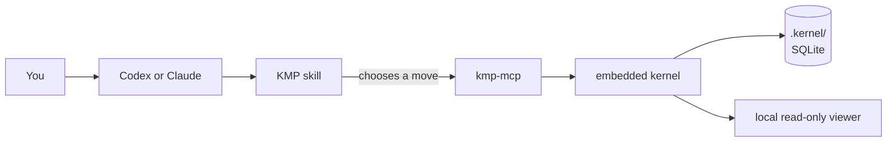
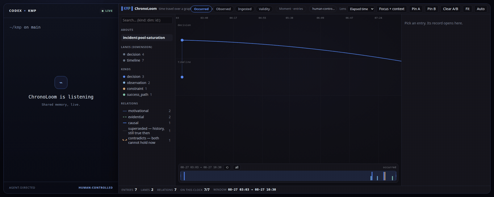

<h1 align="center">KMP — Agent memory that remembers why</h1>

<p align="center">
  
</p>

<p align="center">
  <strong>Local first. Evidence attached. Time included.</strong>
</p>

<p align="center">
  <a href="https://github.com/underpass-ai/kmp/actions/workflows/quality-gate.yml"></a>
  <a href="https://github.com/underpass-ai/kmp/releases"></a>
  <a href="https://crates.io/crates/kmp-mcp"></a>
  <a href="LICENSE"></a>
</p>

KMP remembers decisions, constraints, outcomes and the links that explain
*why*. Your agent gets the context back next session without turning a chat
transcript into a junk drawer.


<sub>Real KMP calls against the isolated checkout-latency demo. No project
memory was harmed. [Replay it yourself](docs/assets/kmp-demo.tape).</sub>

## Why KMP?

Agents are good at doing the work in front of them. Tomorrow is harder. A
decision survives, its rationale disappears, and somebody gets to rediscover
the same incident from scratch.

KMP gives the agent a typed, temporal memory instead of a bag of text:

- evidence decides what can be claimed;
- relations carry the reason two memories belong together;
- time travel is explicit, cursor-based and auditable;
- old decisions are superseded, never quietly rewritten;
- `UNKNOWN` is an honest answer when the evidence is not there.

The normal path runs entirely on your machine. No KMP account. No hosted
memory server. No Underpass cloud.

## Install. Run setup. Done.

### Codex CLI

```bash
codex plugin marketplace add underpass-ai/plugins
codex plugin add kmp@underpass
```

Then ask Codex to run `kmp-setup` and restart Codex once.

### Claude Code

```text
/plugin marketplace add underpass-ai/plugins
/plugin install kmp@underpass
/kmp:setup
```

Restart Claude Code once. Verify either host with its `kmp-doctor` workflow,
or from a terminal:

```bash
kmp-mcp info
kmp-mcp doctor
```

That is the happy path. The plugin owns the MCP registration, so do not add a
second KMP server by hand. Standalone installation, store selection and repair
live in [Embedded KMP](docs/embedded/README.md).

## Talk to it like a human

You normally ask for the outcome. The KMP skill chooses the memory moves.

| You say | The agent does | You get |
|:--|:--|:--|
| “Continue the KMP documentation work.” | Wakes `project:kmp` before re-deriving it. | Current decisions, constraints and next actions. |
| “Why did we choose SQLite?” | Asks memory and follows the stored evidence. | A grounded answer, or `UNKNOWN`. |
| “What happened yesterday?” | Resolves the interval and navigates every temporal page. | Ordered memory from that period. |
| “Remember that retries are capped at two because logs showed amplification.” | Records the decision, its evidence and meaningful relations. | Durable state with an auditable why. |
| “Show the proof between this incident and that decision.” | Traces the typed path and inspects its evidence. | The stored connection, rationale and sources. |
| “Undo that decision.” | Writes a state that supersedes the old one. | Both decisions remain visible in time. |
| “Save the project memory.” | Publishes the maintained project bundle and shows its diff. | Reviewable `.kmp/memory.jsonl`. |

KMP is memory, not surveillance. Store durable decisions and evidence, not
transcripts.

## How it works — the 10-second version



The plugin installs the skills and declares one local MCP process. The skill
turns intent into one or more of thirteen typed tools. `kmp-mcp` validates the
request, and the kernel reads or writes the local graph-temporal store. The
agent—not KMP—turns returned evidence into conversational prose.

## ChronoLoom — memory you can see

Ask Codex or Claude: **“Show me the memory behind this decision.”** ChronoLoom
opens on the evidence and lights up its proof path.



**One shared view:** the agent can steer it; you can click, filter, pan, undo
or take control at any time.

[Explore ChronoLoom](crates/kmp-viewer/README.md) ·
[Technical architecture](docs/architecture/README.md)

### Who owns what?

| Layer | Owns | Does not own |
|:--|:--|:--|
| Plugin | Installation, host discovery, skills and the single MCP declaration. | Memory semantics or a second tool vocabulary. |
| Skills | When to recover, ask, navigate, audit, write, diagnose, save or restore. | Persistence. |
| <code>kmp&#8209;mcp</code> | The schema-checked thirteen-tool boundary over local stdio. | Choosing a workflow from user prose. |
| Kernel | Validation, temporal storage, traversal, deterministic retrieval and proof. | Generating prose or inventing rationale. |

Human workflows such as `kmp-setup`, `kmp-doctor`, `kmp-info`, `kmp-catchup`,
`kmp-save`, `kmp-restore` and `kmp-revert` compose the MCP surface. They are
not extra memory verbs. The machine-checked ownership map is
[`plugins/kmp/capabilities.json`](plugins/kmp/capabilities.json).

<details>
<summary><strong>The thirteen MCP moves</strong></summary>

Ten over memory, three over the view a person is looking at.

| Tool | Purpose |
|:--|:--|
| `kmp_wake` | Recover compact state before continuing work. |
| `kmp_ask` | Retrieve evidence for a semantic question, or `UNKNOWN`. |
| `kmp_goto` | Jump to memory at a time, sequence or ref. |
| `kmp_near` | Inspect the temporal neighborhood around a cursor. |
| `kmp_rewind` | Move backward through memory. |
| `kmp_forward` | Move forward through memory. |
| `kmp_trace` | Prove the path between two refs in one memory graph. |
| `kmp_inspect` | Inspect one object, its links and its evidence. |
| `kmp_write_memory` | Validate and record a decision, constraint or outcome. |
| `kmp_ingest` | Ingest an exact canonical memory graph. |
| `kmp_view_open` | Open or rehydrate a ChronoLoom view over an about. |
| `kmp_view_apply_intent` | Move that view by declaring meaning — focus, clock, zoom, filters, selection — under optimistic concurrency. |
| `kmp_view_get_state` | Read the view's semantic state, never its pixels. |

The view tools never write memory: they carry a closed, semantic vocabulary
with no coordinates in it, and a person at the loom has right of way — an
intent prepared against a stale revision conflicts rather than yanking the
view away.

`tools/list` from the running server is authoritative for schemas, outputs and
the relation vocabulary.

</details>

## Local means local

| Boundary | Default behavior |
|:--|:--|
| Memory | Stored on your machine, normally in the repository's `.kernel/`. |
| MCP transport | Local stdio between the agent host and `kmp-mcp`. |
| Viewer | Read-only loopback HTTP, normally rooted at `http://127.0.0.1:7317/`, behind a random per-session capability. |
| External services | None required. |
| Underpass | Receives no memory and operates no service in this path. |
| Updates | Setup may contact GitHub Releases for checksummed packages. |
| Cloud agents | Evidence returned to a cloud agent follows that host's data policy. |

`.kernel/` is machine state and is ignored by git. A project-scoped store also
maintains `.kmp/memory.jsonl`; it leaves your machine only if you deliberately
commit or copy it.

## Language without flattening the evidence

KMP never translates or rewrites stored evidence. The agent asks first in the
user's language. If the result is `UNKNOWN`, it may retry the query once per
configured fallback language; English is the default fallback. Only the query
changes. Evidence, refs, relation `why` and source metadata stay exactly as
stored, and the agent answers in the user's language.

```bash
kmp-mcp config ask-fallback-languages en,fr
kmp-mcp config ask-fallback-languages none
```

Temporal requests such as “yesterday” use temporal navigation, not semantic
Ask fallback.

## Shared memory, when you actually need it

Several machines can share one live KMP service through the Kubernetes
topology backed by Neo4j, Valkey and NATS JetStream. It is still free, open
source and self-operated. “Enterprise” describes the operational shape—not a
paid tier or an Underpass-hosted product.

It also means owning infrastructure, TLS, identity, authorization and
observability. Keep it local until those responsibilities buy you something.
Then read [Enterprise KMP](docs/enterprise/README.md).

## Project status

KMP is pre-1.0: useful today, actively evolving, and explicit about sharp
edges. Release automation builds `kmp-mcp` for Linux x86_64/arm64, macOS
arm64/x86_64 and Windows x86_64. The embedded path is the default; the remote
API is versioned `v1beta1` and expects an operator.

We do not paste old benchmark numbers into the README. Reproducible, current
evidence belongs in [Research](docs/research/README.md) before it becomes a
claim.

## FAQ

### Does KMP send my memory anywhere?

Not in the default embedded setup. The process, store and viewer are local.
The agent host may be cloud-backed, so evidence sent to that agent follows the
host's policy.

### Do I need Docker, Kubernetes or a database server?

No. The shipped embedded binary uses SQLite. Kubernetes is only for a shared
service.

### Is there an LLM inside KMP?

No. KMP validates, stores, retrieves and proves. Your agent writes the final
answer from the returned evidence.

### What if my question is Spanish but the evidence is English?

Ask fallback can retry the semantic query in English without translating the
stored material. Configure the fallback during setup or with `kmp-mcp config`.

### Can Codex and Claude share the same memory?

Yes: both speak the same MCP contract, and SQLite supports multiple local
hosts. Use the maintained project bundle to move state between machines, or
the enterprise topology for shared network access.

### Is `UNKNOWN` an error?

No. It means the selected memory did not contain eligible evidence for the
question. That is safer than a confident invention.

### The tools disappeared. What now?

Run the host's `kmp-doctor` workflow and follow the
[missing-tools runbook](docs/runbooks/mcp-tools-missing.md). The usual suspects
are a stale host session, duplicate MCP ownership, a missing binary or another
process holding the embedded store.

### Is enterprise KMP paid?

No. The code is Apache-2.0. You operate and pay for any infrastructure you
choose to run.

## Docs and project links

- [Documentation home](docs/index.md)
- [Embedded KMP](docs/embedded/README.md)
- [Enterprise KMP](docs/enterprise/README.md)
- [Technical architecture](docs/architecture/README.md)
- [Runbooks](docs/runbooks/README.md)
- [Development](docs/development/README.md)
- [Research](docs/research/README.md)
- [Contributing](CONTRIBUTING.md)
- [Security policy](SECURITY.md)
- [Changelog](CHANGELOG.md)
- [Issues](https://github.com/underpass-ai/kmp/issues)

The implementation and executable checks win when prose disagrees: MCP
schemas, plugin capabilities, CLI help, Helm values, API contracts and CI
scripts are the source of truth.

## License

[Apache License 2.0](LICENSE). Free and open source.
