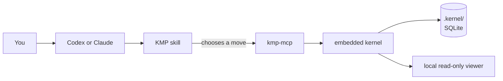

<h1 align="center">KMP — Agent memory that remembers why</h1>

<p align="center">
  <picture><source media="(prefers-color-scheme: dark)" srcset="docs/assets/kmp-emblem-dark.svg"></picture>
</p>

<p align="center">
  <strong>Local first. Evidence attached. Time included.</strong>
</p>

<p align="center">
  <a href="https://github.com/underpass-ai/kmp/actions/workflows/quality-gate.yml"></a>
  <a href="https://github.com/underpass-ai/kmp/releases"></a>
  <a href="https://crates.io/crates/kmp-mcp"></a>
  <a href="LICENSE"></a>
</p>

<!-- kmp:public-overview:begin -->
KMP is local-first memory for coding agents. It runs beside Codex, Claude Code
and Hermes Agent as one small binary with an embedded SQLite store, and it
remembers what was decided, what the evidence was and when it happened. Never
the transcript. No account, no service, no API key: memory stays on your
machine.

Ask your agent **"Why did we choose SQLite?"** and it answers from stored
evidence, or says `UNKNOWN` instead of guessing. Ask **"Show me the memory
behind this decision"** and ChronoLoom, the viewer that ships inside the
binary, opens on that decision and lights up its proof path, with time as a
dimension you can move through and a view the agent and you steer together.
Memory tools retrieve and audit the evidence, view tools steer that shared
ChronoLoom view, and the running server's `tools/list` defines the current
surface.
<!-- kmp:public-overview:end -->

## The problem

Your agent decides something today. Tomorrow a new session, or a different
agent, rediscovers the same incident from scratch, or quietly contradicts the
decision because the reason for it was in a context window that is gone.
Summaries lose the reason; transcripts bury it.

KMP keeps the decision, the evidence it rested on and the moment it happened,
as a typed, temporal memory the next session asks instead of re-deriving:

- evidence decides what can be claimed;
- relations carry the reason two memories belong together;
- time travel is explicit, cursor-based and auditable;
- old decisions are superseded, never quietly rewritten;
- `UNKNOWN` is an honest answer when the evidence is not there.

## See it in two minutes

Install KMP in your host (below), then in any project:

```bash
kmp-mcp demo
```

It writes a worked example into that project's memory — a checkout service,
an incident, the decision that replaced an earlier one and the measurement
that verified it — opens ChronoLoom on it and prints the questions to ask:

| You say | You get |
|:--|:--|
| "Why are retries to the payment provider capped at two?" | The decision, with the incident and the ADR it cites. |
| "What did we believe about retries in August 2026?" | The earlier decision, as it stood then, not the cap that replaced it. |
| "What changed about retries in September 2026?" | The incident, the cap and the measurement, in order. |
| "Show me the memory behind the retry cap decision." | ChronoLoom opens on the decision and lights up its proof path. |

Name KMP and the about `example:kmp-demo` in the request. The example never
enters your project's committed bundle. [More examples](examples/README.md),
including [KMP's own memory](examples/kmp-project/README.md).

## Install

Install the plugin, run setup, restart the host once. The guides reach a fresh
store on the first read; nothing else to run.

### Claude Code

```text
/plugin marketplace add underpass-ai/kmp@marketplace
/plugin install kmp@underpass
/kmp:setup
```

### Codex CLI

```bash
codex plugin marketplace add underpass-ai/kmp --ref marketplace
codex plugin add kmp@underpass
```

Then ask Codex to run `kmp-setup`.

### Hermes Agent

With `kmp-mcp` installed, register it and install the skills through the
native lifecycle:

```bash
kmp-mcp setup --hermes
```

### Verify

```bash
kmp-mcp doctor
```

or run `/kmp:doctor`. The plugin owns the MCP registration, so do not add a
second KMP server by hand. `cargo install kmp-mcp --locked` is the fallback
for a platform with no published engine; MCPB packages, release tarballs and
the Pi coding agent are covered in the
[plugin installation guide](plugins/kmp/README.md). Store selection and
repair live in [Embedded KMP](docs/embedded/README.md).

## Talk to it like a human

You normally ask for the outcome. The KMP skill chooses the memory moves.

| You say | The agent does | You get |
|:--|:--|:--|
| "Continue the KMP documentation work." | Wakes `project:kmp` before re-deriving it. | Current decisions, constraints and next actions. |
| "Why did we choose SQLite?" | Asks memory and follows the stored evidence. | A grounded answer, or `UNKNOWN`. |
| "What does KMP remember from yesterday?" | Resolves the interval and navigates every temporal page. | Ordered memory from that period. |
| "Why was the launch postponed in March?" | Asks memory standing within March: only what fell inside competes, and the lifecycles are read as they stood then. | A grounded answer from that time, or `UNKNOWN` naming the nearest match outside the span. |
| "Remember that retries are capped at two because logs showed amplification." | Records the decision, its evidence and meaningful relations. | Durable state with an auditable why. |
| "Show the proof between this incident and that decision." | Traces the typed path and inspects its evidence. | The stored connection, rationale and sources. |
| "Undo that decision." | Writes a state that supersedes the old one. | Both decisions remain visible in time. |
| "Save the project memory." | Exports the maintained project bundle and shows its diff. | Reviewable `.kmp/memory.jsonl`. |

KMP is memory, not surveillance. Store durable decisions and evidence, not
transcripts.

It also waits to be asked. A session that never mentions memory makes no KMP
call at all. Naming KMP, running a `/kmp:*` command, or opting in from your
project's `CLAUDE.md` or `AGENTS.md` is what opens a route. If you would
rather it enter known work on its own:

```bash
kmp-mcp config memory-routing always
kmp-mcp config memory-routing on-request   # the default
```

Ask in any language. The stored evidence is never translated; the answer
comes back in yours. [How that works](docs/embedded/languages.md).

## How it works — the 10-second version


```mermaid
flowchart LR
    U[You] --> H[Codex or Claude]
    H --> S[KMP skill]
    S -->|chooses a move| M[kmp-mcp]
    M --> K[embedded kernel]
    K --> D[(.kernel/\nSQLite)]
    K --> V[local read-only viewer]
```

The plugin installs the skills and declares one local MCP process. The skill
turns intent into one or more typed tools. `kmp-mcp` validates the request,
and the kernel reads or writes the local graph-temporal store. The agent, not
KMP, turns returned evidence into conversational prose.

| Layer | Owns | Does not own |
|:--|:--|:--|
| Plugin | Installation, host discovery, skills and the single MCP declaration. | Memory semantics or a second tool vocabulary. |
| Skills | When to recover, ask, navigate, audit, write, diagnose, save or restore. | Persistence. |
| <code>kmp&#8209;mcp</code> | The schema-checked tool boundary over local stdio. | Choosing a workflow from user prose. |
| Kernel | Validation, temporal storage, traversal, deterministic retrieval and proof. | Generating prose or inventing rationale. |

[Explore ChronoLoom](crates/kmp-viewer/README.md) ·
[Technical architecture](docs/architecture/README.md)

## Local means local

| Boundary | Default behavior |
|:--|:--|
| Memory | Stored on your machine, normally in the repository's `.kernel/`. |
| MCP transport | Local stdio between the agent host and `kmp-mcp`. |
| Viewer | Read-only loopback HTTP, normally rooted at `http://127.0.0.1:7317/`, behind a random per-session capability. |
| External services | None required; optional TypeSafe Jev integrations send selected text to the configured service. |
| Underpass | Receives no memory and operates no service in this path. |
| Updates | Setup and updates contact GitHub Releases for checksummed packages; the Claude session hook can check releases daily. |
| Local metadata | Agent identities and guide delivery records live outside memory retrieval; quality diagnostics use a separate local journal. |
| Cloud agents | Evidence returned to a cloud agent follows that host's data policy. |

`.kernel/` is machine state and is ignored by git. A project-scoped store also
maintains `.kmp/memory.jsonl`. Export and Git commit are local operations;
pushing, syncing or sharing the bundle makes its contents available elsewhere.
Review its diff before sharing. Evidence read by the agent is also subject to
the host's data policy, independently of whether you share the bundle.

## KMP's own memory

This repository eats its own cooking. [`.kmp/memory.jsonl`](.kmp/memory.jsonl)
is the memory of why KMP is the way it is: the decisions behind it, each with
the document that states it, and the ones that superseded older ones. Restore
it with `/kmp:restore` and ask "why does a release advance the marketplace
branch last?" [How it is written](examples/kmp-project/README.md).

## Shared memory, when you actually need it

Several machines can share one live KMP service through the Kubernetes
topology backed by Neo4j, Valkey and NATS JetStream. It is still free, open
source and self-operated. "Enterprise" describes the operational shape, not a
paid tier or an Underpass-hosted product. It also means owning infrastructure,
TLS, identity, authorization and observability. Keep it local until those
responsibilities buy you something. Then read
[Enterprise KMP](docs/enterprise/README.md).

## Project status

KMP is pre-1.0: useful today, actively evolving, and explicit about sharp
edges. Release automation builds `kmp-mcp` for Linux x86_64/arm64, macOS
arm64/x86_64 and Windows x86_64. The embedded path is the default; the remote
API is versioned `v1beta1` and expects an operator.

We do not paste old benchmark numbers into the README. Reproducible, current
evidence belongs in [Research](docs/research/README.md) before it becomes a
claim.

## FAQ

### Does KMP send my memory anywhere?

Not in the default embedded setup. The process, store and viewer are local.
The agent host may be cloud-backed, so evidence sent to that agent follows the
host's policy.

### Do I need Docker, Kubernetes or a database server?

No. The shipped embedded binary uses SQLite. Kubernetes is only for a shared
service.

### Is there an LLM inside KMP?

No generative model is required for the default embedded path. KMP validates,
stores and retrieves evidence; your agent writes the final answer and the
English search summary. Optional TypeSafe Jev features send selected text to
an external model for judgments, and optional semantic retrieval uses a local
encoder. These integrations require explicit configuration. See
[retrieval defaults and opt-ins](docs/embedded/configuration.md).

### Can Codex and Claude share the same memory?

Yes: both speak the same MCP contract, and SQLite supports multiple local
hosts. Use the maintained project bundle to move state between machines, or
the enterprise topology for shared network access.

### Is `UNKNOWN` an error?

No. It means the selected memory did not contain eligible evidence for the
question. That is safer than a confident invention.

### The tools disappeared. What now?

Run the host's `kmp-doctor` workflow and follow the
[missing-tools runbook](docs/runbooks/mcp-tools-missing.md). The usual suspects
are a stale host session, duplicate MCP ownership, a missing binary or an
unsupported store format.

### Is enterprise KMP paid?

No. The code is Apache-2.0. You operate and pay for any infrastructure you
choose to run.

<details>
<summary><strong>The MCP moves</strong></summary>

Over memory, over the view a person is looking at, and one for persistent
agent identity and progressive guidance. `tools/list` is the authority.

| Tool | Purpose |
|:--|:--|
| `kmp_guide` | Open a capability map, preserve agent identity and expand one worked card. |
| `kmp_wake` | Recover compact state before continuing work. |
| `kmp_ask` | Retrieve evidence for a semantic question, or `UNKNOWN`. |
| `kmp_relate` | Read what the memories of several abouts have to do with each other in a span, off the scopes and clocks they share. |
| `kmp_time` | Move through memory on one clock: `rewind` and `forward` page backward and forward from a cursor or through an interval, `goto` jumps to a time, sequence or ref, `near` reads the neighbourhood around one. |
| `kmp_trace` | Audit a path between two refs, or search for evidence from seed refs; inspect returned support and completeness. |
| `kmp_inspect` | Inspect one object inside an explicit `about`, with its links and evidence. |
| `kmp_write_memory` | Validate and record a decision, constraint or outcome. |
| `kmp_ingest` | Ingest an exact canonical memory graph. |
| `kmp_relabel` | Change the labels a memory stands in — add, take off, and why — without rewriting its text. |
| `kmp_condense` | Write a compact reader card for one stored body, bound to the exact version it was read from. |
| `kmp_summaries_audit` | Read where an about's memories stand with respect to their English search summaries: what is missing, what the lint refuses, and what stands and still retrieves little. |
| `kmp_curate` | Review the relations of one or several abouts with TypeSafe Jev as an opt-in second reader: pairs nothing declares, with the type Jev would choose, and declared relations whose reason Jev doubts. The agent writes every relation. |
| `kmp_view_open` | Open or rehydrate a ChronoLoom view over an about. |
| `kmp_view_apply_intent` | Move that view by declaring meaning — focus, clock, zoom, filters, selection — under optimistic concurrency. |
| `kmp_view_get_state` | Read the view's semantic state, never its pixels. |

The view tools never write memory: they carry a closed, semantic vocabulary
with no coordinates in it, and a person at the loom has right of way — an
intent prepared against a stale revision conflicts rather than yanking the
view away.

Human workflows such as `kmp-setup`, `kmp-doctor`, `kmp-info`, `kmp-catchup`,
`kmp-save`, `kmp-restore` and `kmp-revert` compose the MCP surface. They are
not extra memory verbs. The machine-checked ownership map is
[`plugins/kmp/capabilities.json`](plugins/kmp/capabilities.json).

</details>

## Docs and project links

- [Documentation home](docs/index.md)
- [Embedded KMP](docs/embedded/README.md)
- [Retrieval defaults and store configuration](docs/embedded/configuration.md)
- [Languages](docs/embedded/languages.md)
- [Examples](examples/README.md)
- [Enterprise KMP](docs/enterprise/README.md)
- [Technical architecture](docs/architecture/README.md)
- [Runbooks](docs/runbooks/README.md)
- [Development](docs/development/README.md)
- [Research](docs/research/README.md)
- [Contributing](CONTRIBUTING.md)
- [Security policy](SECURITY.md)
- [Changelog](CHANGELOG.md)
- [Issues](https://github.com/underpass-ai/kmp/issues) ·
  [Discussions](https://github.com/underpass-ai/kmp/discussions)

The implementation and executable checks win when prose disagrees: MCP
schemas, plugin capabilities, CLI help, Helm values, API contracts and CI
scripts are the source of truth.

## License

[Apache License 2.0](LICENSE). Free and open source.
