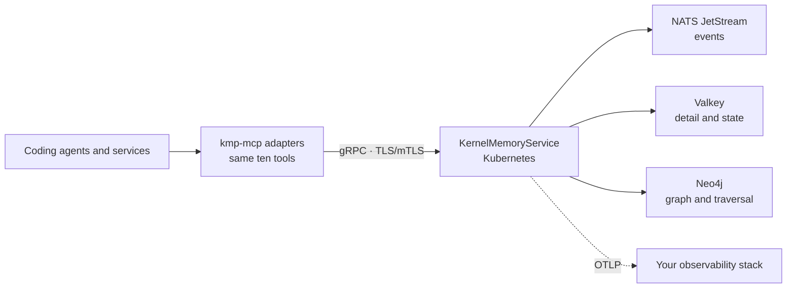

# Enterprise KMP on Kubernetes

All KMP code for this deployment is free and open source under the
[Apache 2.0 license](../LICENSE). “Enterprise” names the shared Kubernetes
topology; it is not a paid product tier and does not require a commercial
license or an Underpass-hosted service. Third-party storage and observability
components retain their own licenses.

The default KMP experience remains local: one `kmp-mcp` process embeds the
kernel and stores memory on the developer's machine. Use the enterprise mode
only when several people, agents or services need concurrent access to one
live, centrally operated memory.

## What changes, and what does not

| | Local KMP | Enterprise KMP |
|:--|:--|:--|
| Kernel location | Inside the local `kmp-mcp` process | `KernelMemoryService` in Kubernetes |
| Storage | Local `.kernel/` with redb or sqlite | Neo4j, Valkey and NATS JetStream |
| Sharing | Optional reviewed bundle through git | Live server-side access |
| Transport | Local stdio; no memory network surface | gRPC with server TLS or mTLS |
| Observability | Local logs and bounded quality journal | OpenTelemetry and centralized logs/metrics |
| Operations | No service to operate | Helm release, secrets, certificates and upgrades |
| MCP tools | The same ten tools | The same ten tools |
| Skills | The same plugin workflows | The same plugin workflows |

The memory model is identical in both modes: about scopes, dimensions,
temporal movement, typed relations, evidence and proof. The embedded and gRPC
paths share proto mapping and are held to the same conformance suite.

## Architecture



`kmp-mcp` remains the agent-facing adapter. Instead of embedding the kernel,
it forwards the same typed operations to `KernelMemoryService`. The kernel
owns validation, idempotency, optimistic concurrency, projection and reads;
the storage services remain behind ports.

The Helm chart can deploy Neo4j, Valkey and NATS inside its namespace or use
connections to services operated elsewhere. An optional authenticated
Streamable HTTP MCP adapter is available for environments that need a public
MCP boundary; it does not own storage and forwards authorized calls to the
same kernel.

## When to choose it

Use Kubernetes when at least one of these is a real requirement:

- several users, agents or services must observe new memory without exchanging
  repository bundles;
- the memory service needs a centrally managed availability and upgrade path;
- gRPC transport must use TLS or mutual TLS;
- credentials must come from Kubernetes secrets;
- traces, metrics and structured logs must reach the organization's own
  collectors;
- an operator must audit decisions independently of the workstation that
  produced them.

If none applies, local KMP is simpler and remains the recommended mode.

## Deployment path

The chart lives in [`distribution/charts/kmp`](../distribution/charts/kmp). Before deploying, choose:

1. a pinned `v*` image tag or digest;
2. in-chart or externally managed Neo4j, Valkey and NATS;
3. plaintext, server TLS or mutual TLS for inbound gRPC;
4. Kubernetes secrets for connection strings and certificates;
5. ingress and DNS only when the kernel must be reached from outside the
   cluster;
6. the OpenTelemetry destination and log collection policy.

Render and review the release before applying it:

```bash
helm template kmp distribution/charts/kmp \
  --namespace kmp \
  --values <enterprise-values.yaml> \
  --set image.tag=vX.Y.Z

helm upgrade --install kmp distribution/charts/kmp \
  --namespace kmp --create-namespace \
  --values <enterprise-values.yaml> \
  --set image.tag=vX.Y.Z \
  --atomic --wait
```

Do not copy the repository's Underpass runtime values unchanged into another
organization: hostnames, ingress, image-pull secrets and security choices are
environment-specific. The complete workflow is in the
[Docker and Kubernetes operations](./operations/deployment/README.md).

## Connecting an agent

Point the same `kmp-mcp` binary used locally at the deployed endpoint:

```bash
KMP_KERNEL_GRPC_ENDPOINT=https://kmp.example.com:443 \
KMP_KERNEL_GRPC_TLS_MODE=mutual \
KMP_KERNEL_GRPC_TLS_CA_PATH=/var/run/kmp/ca.crt \
KMP_KERNEL_GRPC_TLS_CERT_PATH=/var/run/kmp/tls.crt \
KMP_KERNEL_GRPC_TLS_KEY_PATH=/var/run/kmp/tls.key \
KMP_KERNEL_GRPC_TLS_DOMAIN_NAME=kmp.example.com \
  kmp-mcp
```

The plugin and its skills do not change. `kmp_wake`, `kmp_ask`, temporal
navigation, audit and writes keep the same request and response contracts.

## Security boundaries

- Inbound gRPC supports plaintext, server TLS and mutual TLS. Enterprise
  deployments should select TLS deliberately rather than inherit a default.
- Valkey, NATS and OTLP support TLS and client certificates through chart
  values and mounted secrets.
- Neo4j supports server TLS and CA trust. Client-certificate authentication is
  currently limited by the Rust driver stack.
- Credentials belong in Kubernetes secrets, never inline in committed values.
- `ValidateScope` is set comparison, not a complete authorization backend.
  The caller remains responsible for access control.
- The optional public HTTP MCP adapter has its own issuer, audience, JWKS and
  origin policy; enabling it is an explicit additional boundary.

Threat model and configuration details:
[security model](./security-model.md) and
[Docker and Kubernetes operations](./operations/deployment/README.md#operational-authority).

## Observability and verification

The cluster edition emits structured logs and OpenTelemetry signals to the
collectors you configure. Projection consumers use explicit acknowledgements;
a failed handler stops instead of silently skipping an event and leaving a
hole in memory.

After deployment, enable and run the Helm tests:

```bash
helm upgrade kmp distribution/charts/kmp --reuse-values --set e2e.enabled=true
helm test kmp --timeout 5m
```

The hooks cover transport, mTLS and the typed `KernelMemoryService` lifecycle.
Run `./scripts/e2e/regen.sh` before expensive live validation so stale images,
drifted Helm values, missing certificates and endpoint mismatches fail early.

## Moving from local memory

Changing `KMP_KERNEL_GRPC_ENDPOINT` changes where future calls run. It does not
upload the local `.kernel/` directory.

Treat data movement as a separate migration:

1. stop writers to the local store;
2. export and verify its `.kmp/memory.jsonl` bundle;
3. plan canonical ingest into the cluster;
4. verify about coverage, temporal order, relations and evidence in the
   deployed kernel;
5. only then switch agents to the gRPC endpoint.

The local store remains the rollback evidence until the migration is accepted.
Never copy engine files into cluster storage or hand-interleave JSONL histories.

## Current limits

- There is no complete authorization backend in `KernelMemoryService` today.
- Neo4j client-certificate authentication is constrained by the current Rust
  driver.
- Moving a local bundle into a cluster is an ingest migration, not an automatic
  sync feature.

See the [edition comparison](./editions.md), [runtime guarantees](./runtime-guarantees.md)
and [Docker and Kubernetes operations](./operations/deployment/README.md) for
the operational contracts behind this overview.
