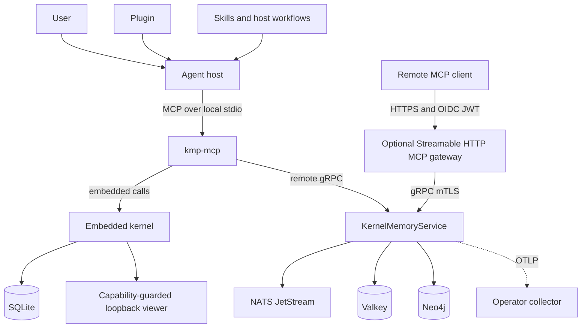
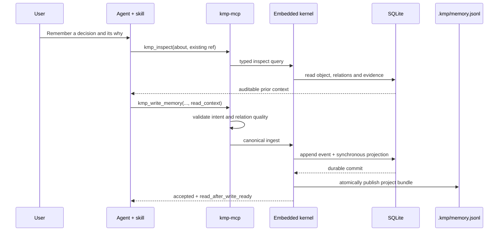
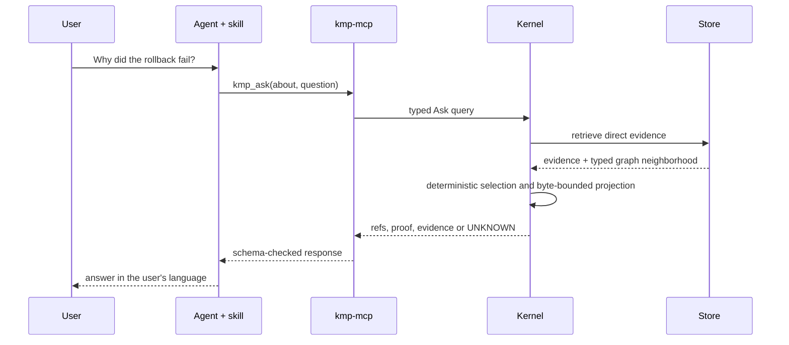
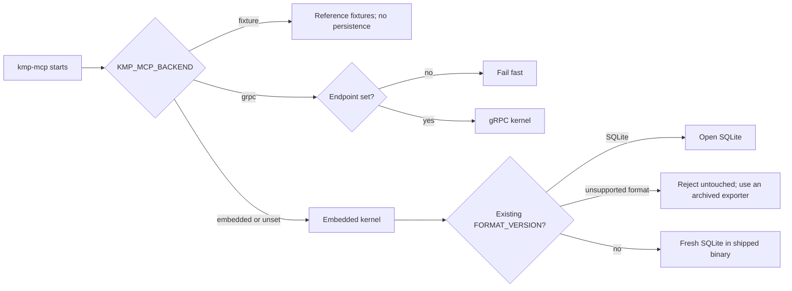

# Architecture

This section is technical by design. It describes the executable boundaries
shared by the embedded and enterprise compositions; it does not describe the
archived product plans.

The current [architecture conformance audit](conformance-audit-2026-08-28.md)
checks SOLID, domain types, dependency direction and module ownership, then
orders the findings into small behaviour-preserving PRs. The
[kmp-mcp layer map](kmp-mcp-layer-map.md) executes its `kmp-mcp` findings for
#404: every file's target context and layer, and the slice order.

## System map

The plugin is not a kernel adapter. It packages discovery and orchestration.
`kmp-mcp` is the protocol boundary. Both composition roots call the same
application use cases and expose the same thirteen MCP tools.

## Layer ownership

| Layer | Responsibility | Authoritative code |
|:--|:--|:--|
| Host plugin | Discovery, single MCP ownership, skills and human workflows | `plugins/kmp` |
| MCP adapter | JSON-RPC framing, schemas, pagination projection and backend selection | `crates/kmp-mcp` |
| Memory API | Versioned record and recall requests/views | `crates/kmp-memory-api` |
| Application | Ingest, wake, ask, temporal traversal, trace and inspect use cases | `crates/kmp-application` |
| Domain | Memory objects, relations, temporal coordinates and invariants | `crates/kmp-domain` |
| Ports | Persistence and projection interfaces | `crates/kmp-ports` |
| Embedded composition | In-process application plus local adapters | `crates/kmp-embedded`, `crates/kmp-adapter-embedded` |
| Enterprise composition | gRPC service plus Neo4j, Valkey and NATS adapters | `crates/kmp-server`, `crates/kmp-transport-grpc`, `crates/kmp-adapter-*` |
| HTTP gateway | OIDC authentication and tool-level authorization before gRPC forwarding | `crates/kmp-mcp-http` |

## Embedded write path

The commit-native bundle is maintained only for a project-scoped store. A
rejected validation does not create a partial write.

## Evidence-first read path

KMP does not generate the final answer. Direct evidence determines eligibility;
typed relations and their stored `why` can improve ordering and explain the
path. The agent generates conversational prose from the returned proof.

## Temporal model

Every recorded entry has an `observed_at` coordinate. Dimensions group entries
by task, process, episode or another explicit scope. Temporal reads use a
cursor and return visible pagination state; a partial page is never presented
as a complete interval.

`kmp_goto`, `kmp_near`, `kmp_rewind` and `kmp_forward` move through stored
time. `kmp_trace` and `kmp_inspect` audit graph structure and evidence. Semantic
Ask is not a substitute for temporal navigation.

## Backend selection

An endpoint may select gRPC when the backend is otherwise unspecified. Invalid
explicit combinations fail instead of silently opening a different store.

## Trust boundaries

| Boundary | Embedded | Enterprise |
|:--|:--|:--|
| Agent to MCP | Same-machine stdio | Same-machine stdio or remote HTTPS MCP |
| MCP to kernel | In-process call | gRPC with optional TLS/mTLS |
| User authorization | Agent host and local filesystem policy | OIDC scopes/resource grants at HTTP gateway; operator policy for direct gRPC |
| Persistence | Local filesystem | Neo4j, Valkey and NATS credentials and network policy |
| Human inspection | Loopback viewer with a random, process-lifetime capability | Operator-selected interfaces and telemetry |
| Failure mode | Store, format or lock errors | Network, identity, storage and projection failures in addition to domain errors |

## Deployment views

- [Embedded KMP](../embedded/README.md) defines the local composition.
- [Enterprise KMP](../enterprise/README.md) defines the remote composition.
- [Enterprise security](../enterprise/security.md) defines network and identity
  boundaries.
- [Enterprise observability](../enterprise/observability.md) defines the
  diagnostic boundary.

## Runbooks

- [MCP tools are missing](../runbooks/mcp-tools-missing.md)
- [Recover or move an embedded store](../runbooks/embedded-recovery.md)
- [Deploy or update enterprise KMP](../runbooks/enterprise-deployment.md)

Runbooks use the live CLI, chart and CI scripts as authority. If a command has
drifted, update the runbook in the same change that updates the executable
contract.
