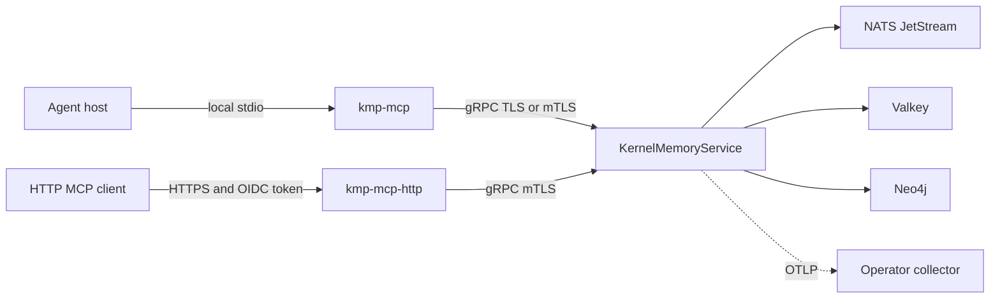

# Enterprise KMP

Enterprise KMP is the optional shared topology for organizations that need one
live memory across machines, agents or services. It is self-operated, free and
open source under Apache 2.0. It is not a paid tier and does not connect to an
Underpass-hosted memory service.

Start with [embedded KMP](../embedded/README.md) unless a shared service is a
real requirement.

## What changes

| | Embedded | Enterprise |
|:--|:--|:--|
| Kernel | Inside local `kmp-mcp` | `kmp-server` exposes `KernelMemoryService` |
| Agent transport | Local stdio | Local `kmp-mcp` forwards to gRPC, or optional HTTP MCP gateway |
| Storage | Local SQLite store | Neo4j graph, Valkey detail/state, NATS JetStream events |
| Operations | No service | Container image, Helm release and external dependencies |
| Security | No memory network boundary | TLS/mTLS, identity and authorization boundaries |
| Observability | Local logs and quality journal | Structured logs and optional OTLP pipeline |

The agent-facing MCP server still advertises the same fifteen tools. The plugin
and skills do not become a second protocol.

## Architecture



The HTTP MCP gateway is optional. It owns no storage and only forwards
authorized calls to the kernel.

## Choose enterprise when

- clients on different machines must observe the same live memory;
- a team needs a centrally managed availability and upgrade boundary;
- transport identity and authorization must be enforced at a network edge;
- secrets, certificates, logs and telemetry must use organizational systems;
- an operator must audit the service independently of one workstation.

Git review of a portable local bundle does not require enterprise KMP.

## Start here

1. Read [deployment and operations](operations.md).
2. Define the [security boundary](security.md) before exposing an endpoint.
3. Connect the operator's [observability](observability.md).
4. Run chart and transport validation before directing agents to the service.

Point a local `kmp-mcp` adapter at the deployed gRPC endpoint:

```bash
KMP_MCP_BACKEND=grpc \
KMP_KERNEL_GRPC_ENDPOINT=https://kmp.example.com:443 \
KMP_KERNEL_GRPC_TLS_MODE=mutual \
KMP_KERNEL_GRPC_TLS_CA_PATH=/path/ca.crt \
KMP_KERNEL_GRPC_TLS_CERT_PATH=/path/client.crt \
KMP_KERNEL_GRPC_TLS_KEY_PATH=/path/client.key \
KMP_KERNEL_GRPC_TLS_DOMAIN_NAME=kmp.example.com \
  kmp-mcp
```

Setting an endpoint changes where future calls run. It does not upload a
local `.kernel/` directory. Moving memory is a separate, verified ingest
migration.

## Current boundaries

- The container runs `kmp-server`; it does not create Neo4j, Valkey or NATS by
  itself.
- The repository has no maintained Docker Compose deployment. Kubernetes via
  the Helm chart is the supported assembled topology.
- The default chart enables neither infrastructure dependencies nor TLS and
  refuses an unspecified image. Production values must be explicit.
- Direct gRPC mTLS authenticates certificates but does not provide a complete
  end-user authorization policy. Restrict direct access at the operator's
  boundary.
- The optional HTTP MCP gateway adds OIDC JWT scopes and resource filters; it
  requires gateway-to-kernel mTLS.
- Neo4j client-certificate authentication is not implemented by the current
  adapter. Use a secure URI, CA trust and the database's supported credentials.

## Implementation authority

- [`Dockerfile`](../../Dockerfile)
- [`distribution/charts/kmp`](../../distribution/charts/kmp/)
- [`crates/kmp-server`](../../crates/kmp-server/)
- [`crates/kmp-mcp-http`](../../crates/kmp-mcp-http/)
- [`api/proto`](../../api/proto/)
